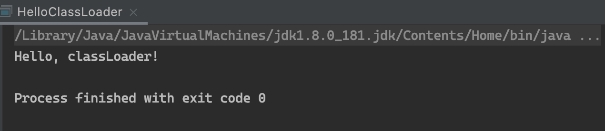
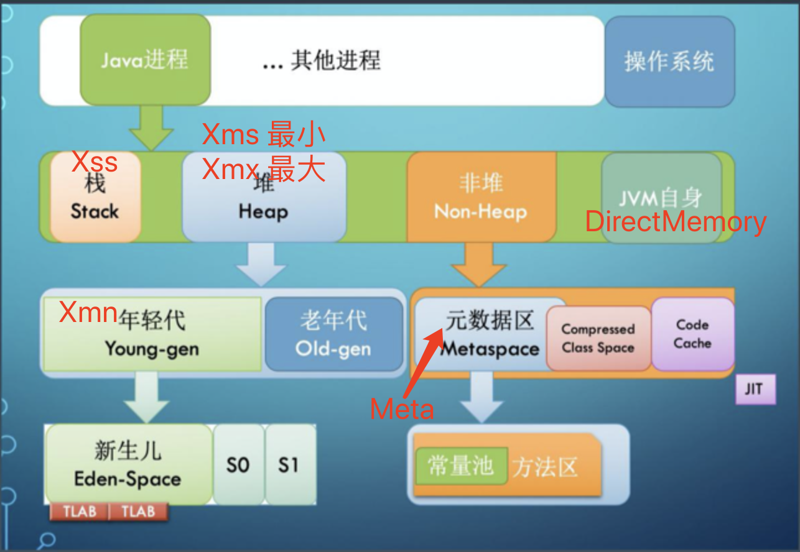
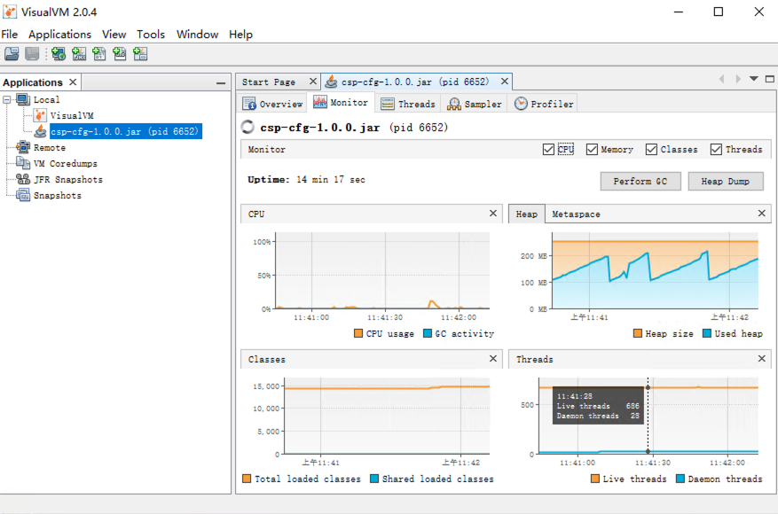

# Week 01
## 课后作业

### 第一课第一题

代码见 Hello.java，运行以下命令

``` sh
cd Week_01
javac ./Hello1/Hello.java #编译
javap -c ./Hello1/Hello.class #查看字节码
```

字节码分析见 [Hello.bytecode](./Hello1/Hello.bytecode)

### 第一课第二题

参见 [HelloClassLoader.java](./HelloClassLoader.java)

运行结果


### 第一课第三题



### 第一课第四题

``` sh
[s@deployment-tce-6984cffb5b-7ddqf ~]$ jps -lmv
1 /opt/application/app.jar -XX:+PrintGCDetails -XX:+PrintGCDateStamps -XX:+PrintGCTimeStamps -Xloggc:/opt/logs/gc.log -XX:+UseGCLogFileRotation -XX:NumberOfGCLogFiles=5 -XX:GCLogFileSize=100M -XX:+HeapDumpOnOutOfMemoryError -XX:HeapDumpPath=/opt/logs/apperror.hprof -Xmx2800M -Xms2800M -Xmn700M -XX:SurvivorRatio=6 -XX:+UseConcMarkSweepGC -Dspring.profiles.active=prd
```

项目使用的是 CMS GC，新生代的比例是 1:1:6。运维已经根据 app 运行的情况设置了新生代 700M，老年代 2100M。

### 第二课

G1GC 运行情况

- 默认最大堆大小为内存的 1/4
- 分区数 4046，分区大小 1MB
- Eden 区已用 100 份，Survivor已用 10 份，Old 区已用 79 份 

```
PS C:\Users\Administrator> jmap -heap 6652
Attaching to process ID 6652, please wait...
Debugger attached successfully.
Server compiler detected.
JVM version is 25.181-b13

using thread-local object allocation.
Garbage-First (G1) GC with 10 thread(s)

Heap Configuration:
   MinHeapFreeRatio         = 40
   MaxHeapFreeRatio         = 70
   MaxHeapSize              = 4242538496 (4046.0MB)
   NewSize                  = 1363144 (1.2999954223632812MB)
   MaxNewSize               = 2544893952 (2427.0MB)
   OldSize                  = 5452592 (5.1999969482421875MB)
   NewRatio                 = 2
   SurvivorRatio            = 8
   MetaspaceSize            = 21807104 (20.796875MB)
   CompressedClassSpaceSize = 1073741824 (1024.0MB)
   MaxMetaspaceSize         = 17592186044415 MB
   G1HeapRegionSize         = 1048576 (1.0MB)

Heap Usage:
G1 Heap:
   regions  = 4046
   capacity = 4242538496 (4046.0MB)
   used     = 197132288 (188.0MB)
   free     = 4045406208 (3858.0MB)
   4.646564508156204% used
G1 Young Generation:
Eden Space:
   regions  = 100
   capacity = 139460608 (133.0MB)
   used     = 104857600 (100.0MB)
   free     = 34603008 (33.0MB)
   75.18796992481202% used
Survivor Space:
   regions  = 10
   capacity = 10485760 (10.0MB)
   used     = 10485760 (10.0MB)
   free     = 0 (0.0MB)
   100.0% used
G1 Old Generation:
   regions  = 79
   capacity = 116391936 (111.0MB)
   used     = 81788928 (78.0MB)
   free     = 34603008 (33.0MB)
   70.27027027027027% used

29517 interned Strings occupying 3017880 bytes.
```


