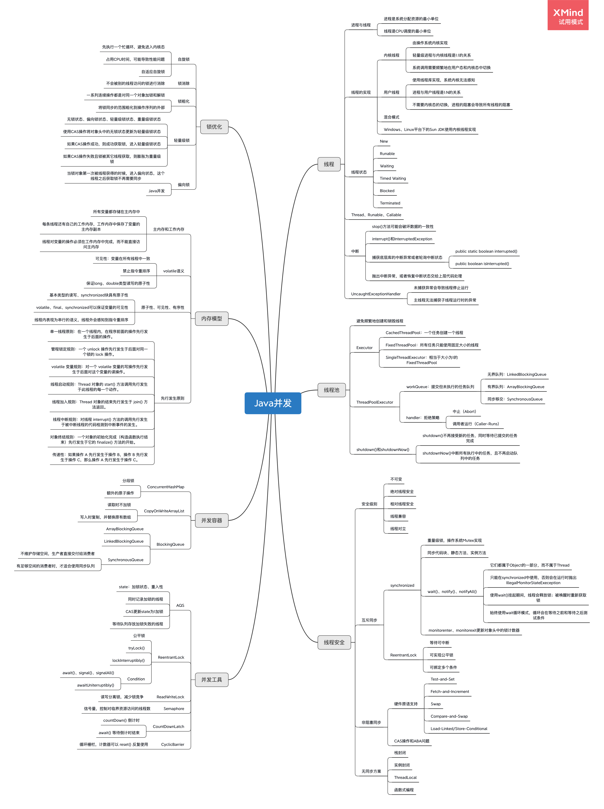

# Week 04
## 周四
### 2.（必做）思考有多少种方式，在 main 函数启动一个新线程，运行一个方法，拿到这个方法的返回值后，退出主线程？
[Homework.java](./Homework.java)

## 周六
### 4.（必做）把多线程和并发相关知识带你梳理一遍，画一个脑图，截图上传到 Github 上。

[Java并发编程 Markdown](./Java并发编程.md)

